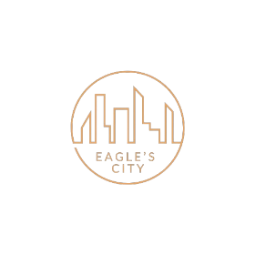

<a name="readme-top">

<br/>

<br />
<div align="center">
  <a href="https://github.com/farahKenawy">
    
  </a>
  <h3 align="center">WD-Seatwork4</h3>
</div>
<!-- TODO: Make a short description -->
<div align="center">
Develop a Features Display Website using pure HTML and CSS, highlighting unique design layouts for various features. The project should encompass multiple pages to demonstrate diverse layouts effectively. Focus on ensuring the website is well-structured, deployed, and update the README file to reflect these aspects.
</div>

<br />

<!-- TODO: Change the zyx-0314 into your github username  -->
<!-- TODO: Change the WD-Template-Project into the same name of your folder -->


---

<br />
<br />

<!-- TODO: If you want to add more layers for your readme -->
<details>
  <summary>Table of Contents</summary>
  <ol>
    <li>
      <a href="#overview">Overview</a>
      <ol>
        <li>
          <a href="#key-components">Key Components</a>
        </li>
        <li>
          <a href="#technology">Technology</a>
        </li>
      </ol>
    </li>
    <li>
      <a href="#rule,-practices-and-principles">Rules, Practices and Principles</a>
    </li>
    <li>
      <a href="#resources">Resources</a>
    </li>
  </ol>
</details>

---

## Overview

<!-- TODO: To be changed -->
<!-- The following are just sample -->
Project Description:
The project involves creating a Features Display Website for showcasing distinct design layouts using HTML, CSS, and optionally JavaScript. This website will serve as a platform to demonstrate various design approaches and layouts, emphasizing creativity and functionality.

Purpose:
The primary purpose of the Features Display Website is to showcase different design layouts and demonstrate their application in web development. It aims to inspire and educate users, particularly web developers and designers, on effective layout strategies, usability considerations, and aesthetic choices.

Key Components:

HTML Structure: Utilize HTML to create the foundational structure of the website, including multiple pages each dedicated to showcasing a different design layout.

CSS Styling: Employ CSS to design and style each layout effectively. This includes defining colors, typography, spacing, and responsive design principles to ensure compatibility across devices.

JavaScript: JavaScript can be used to enhance interactivity and functionality. This might include dynamic elements, animations, or user interface enhancements to further engage visitors.

### Key Components
<!-- TODO: List of Key Components -->
<!-- The following are just sample -->
- MultiPage Website
- Parallax transition
- Feature Pages
- Animations

### Technology
<!-- TODO: List of Technology Used -->


## Rules, Practices and Principles
1. Always use `WD-` in the front of the Title of the Project for the Subject followed by your custom naming.
2. Do not rename any .html files; always use `index.html` as the filename.
3. Place Files in their respective folders.
4. All file naming are in camel case.
   - Camel case is naming format where there is no white space in separation of each words, the first word is in all lower case while the succeding words first letter are in upper followed by lower cased letters.
   - ex.: buttonAnimatedStyle.css
5. Use only `External CSS`.
6. Renaming of Pages folder names are a must, and relates to what it is doing or data it holding.
7. File Structure to follow below.

```
WD-ProjectName
└─ assets
|   └─ css
|   |   └─ style.css
|   └─ img
|   |   └─ fileWith.jpeg/.jpg/.webp/.png
|   └─ js
|       └─ script.js
└─ pages
|  └─ pageName
|     └─ assets
|     |  └─ css
|     |  |  └─ style.css
|     |  └─ img
|     |  |  └─ fileWith.jpeg/.jpg/.webp/.png
|     |  └─ js
|     |     └─ script.js
|     └─ index.html
└─ index.html
└─ readme.md
```

## Resources

<!-- TODO: Add References -->
| Title | Purpose | Link |
|-|-|-|
| Developer | Family relative credited | none |
| Pinterest | Images | https://ph.pinterest.com/ |
| DevOut | References for Card Designs | https://devdevout.com/css/css-cards |
| nicepage | References for Feature Designs | https://nicepage.com/k/feature-web-page-design |


